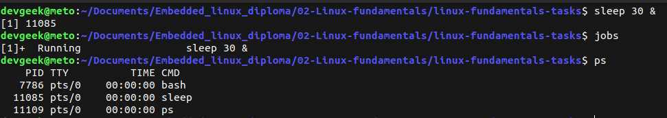
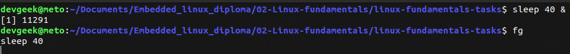
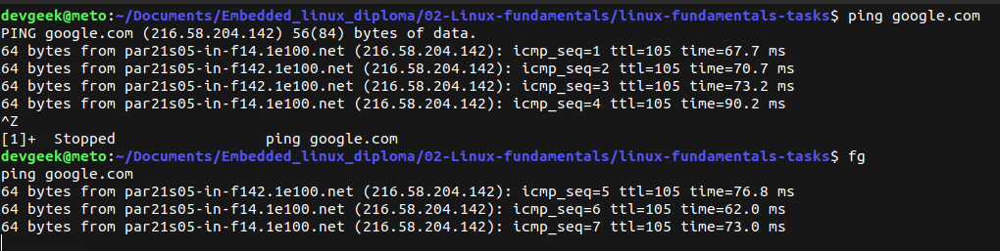
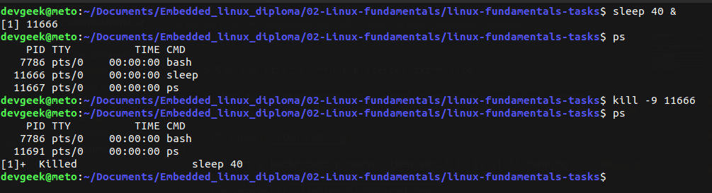
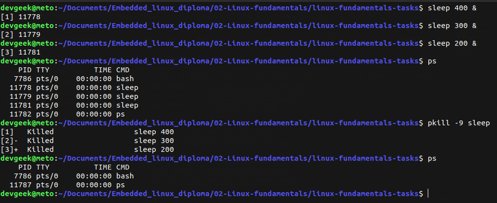
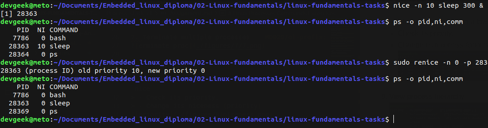
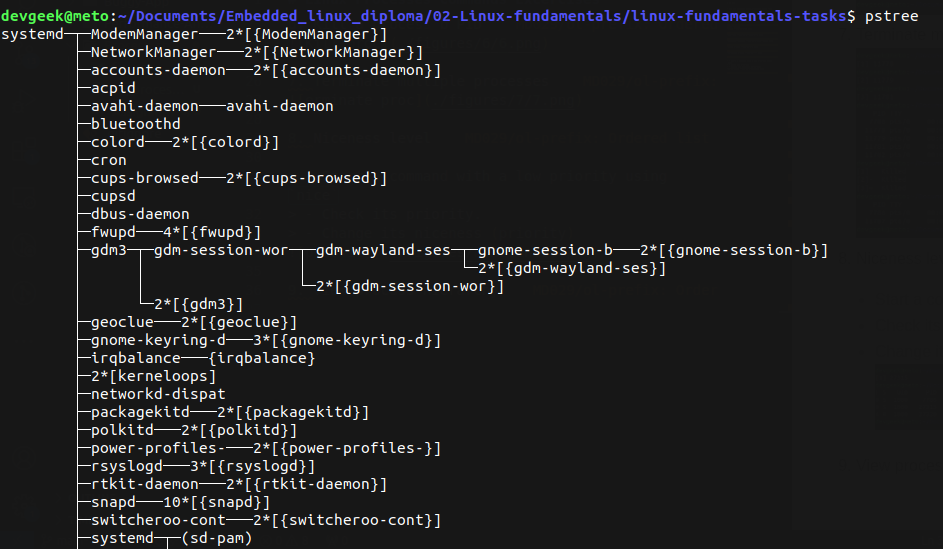
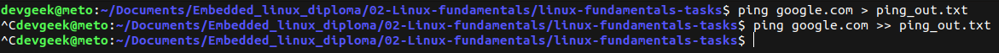
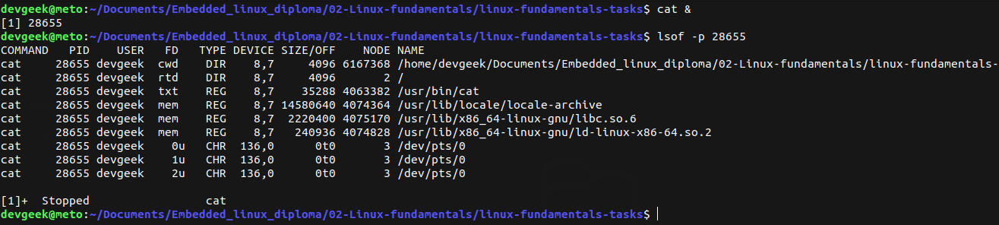

# Linux Processes Commands Excercises

1. List all running processes Use the `ps` command to list all processes running on your system.
`
$ ps aux
`

> See the attached **all_precesses.txt** file

2. Monitor system processes in real-time using `top/htop` command and identify the most CPU-intensive process.

3. Start a background process. then verif it is still running.

4. Bring a background process to the foreground

5. suspend and resume a process

6. Kill a process b PID

7. Terminate multiple processes

8. Niceness level

> - Start a command with a low priority using `nice`
> - Check its priority.
> - Change its niceness (priority)

9. View process hierarchy

10. Redirect process output

> check the output file **ping_out.txt**

11. Monitor file descriptor

12.  Create and terminate a zombie process

