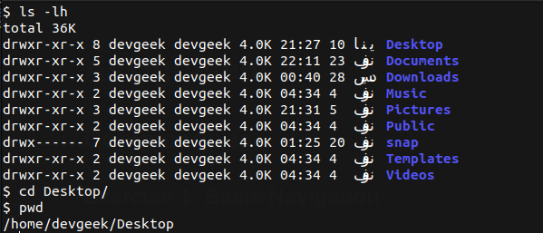
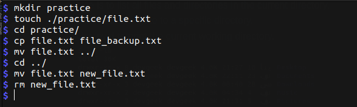
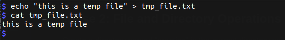
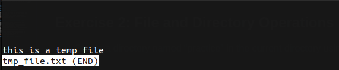
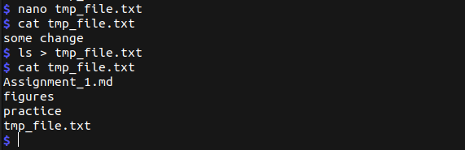
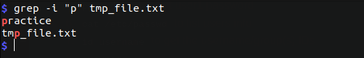

# Assignment 1

## Commands-fs

### Exercise 1: Basic Navigation

- Use ls to list all files and directories in the current directory.
- Use cd to navigate to a specific directory.
- Use pwd to print the current working directory.

### Exercise 2: File and Directory Operations

- Create a directory named “practice” in the current directory using mkdir.
- Create an empty file named “file.txt” within the “practice” directory using touch.
- Copy “file.txt” to a new file “file_backup.txt” using cp.
- Move “file_backup.txt” to another directory using mv.
- Rename “file.txt” to “new_file.txt” using mv.
Delete the “new_file.txt” using rm.

### Exercise 3: File Viewing and Editing

- Create a text file using `echo` or a text editor like `nano`.
- View the contents of the file using `cat`.
- View the contents of the file using `less`.
- Edit the file using nano or another text editor. Redirect the output of a command (e.g., `ls`) to a file using `>`.

### Exercise 4: File Permissions

- Create a file and set specific permissions using chmod. Check the permissions of the file using ls -l. Change the owner and group of the file using chown. Verify the changes using `ls -l`.

`$ touch myfile.txt`
`$ chmod 644 myfile.txt` change the permission of file to **rw-r--r--**
`$ ls -l myfile.txt`

- output:  `-rw-r--r-- 1 Usr1 Group1 0 Jan 11 20:31 myfile.txt`

`$ sudo chown Usr2:Group2 myfile.txt`
`$ ls -l myfile.txt`

- output: `-rw-r--r-- 1 Usr2 Group2 0 Jan 11 20:33 myfile.txt`

### Exercise 5: User and Group Management

- Create a new user using `useradd`. Set a password for the new user using passwd. Create a new group using `groupadd`. Add the user to the newly created group using `usermod`.

> Commands:
>>
>> 1. `useradd` to add new user
>> 2. `userdel` to delete user
>> 3. `usermod` to control user
>> 4. `usermod -aG group1 user1` to add user1 to group1
>> 5. `passwd user1` set user1 password
>> 6. `cat /etc/passwd` to list users info
>> 7. `id username` to get the username/group(s) IDs
>> 8. `groupadd` to add new group
>> 9. `groupdel` to add delete group
>> 10. `cat /etc/group` to list groups info

### Exercise 6: Process Management

- List all processes using ps. List processes in real-time using top. Find a specific process using pgrep. Terminate a process using kill.

### Exercise 7: File Searching

- Use find to search for a specific file or directory. Use grep to search for a specific string in a file.

> `$ find . -type f -name tmp_file.txt`
>> output: `./tmp_file.txt`

